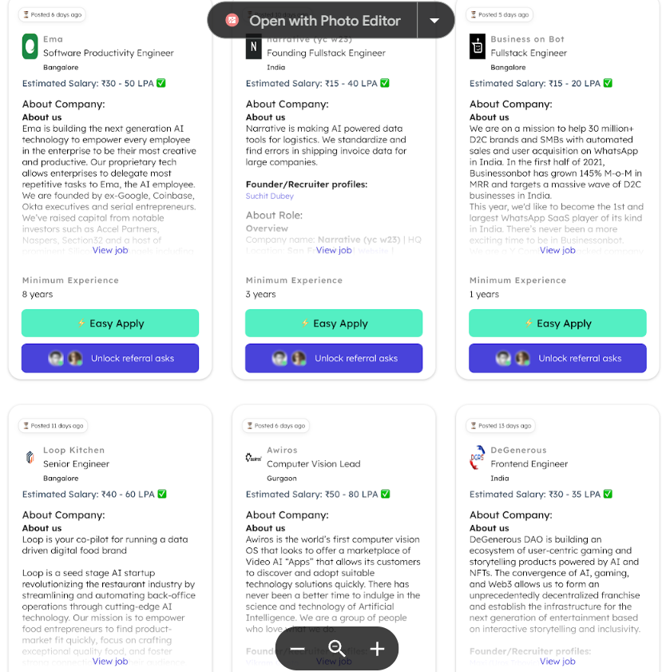

# Weekday Assignment Project(Round 1)

How to run locally.

## Prerequisites

Before running this project, make sure you have the following installed on your machine:

- Node.js
- npm

## Getting Started with the task

0. Live Link for the Project Demo [Click Here🔗](https://663a3363091c680b63f8e735--profound-malasada-04406f.netlify.app/)

1. Clone this repository to your local machine:

   ```bash
   git clone https://github.com/Pranshu1sati/Weekday.git
   ```

2. Navigate to the project directory:

   ```bash
   cd weekdy
   ```

3. Install the dependencies:

   ```bash
   npm install/yarn install
   ```

4. Start the development server:

   ```bash
   npm run dev/yarn dev
   ```

5. Open your browser and visit [http://localhost:5173](http://localhost:5173) to see the running application.

6. Task understanding & Description Build an Infinite Scroll with filtering functionality using React, Redux, MUI, & CSS

   - Replicate this UI as closely as possible
     

7. Approach and Plan of attack

   - Set UP Redux Toolkit Query Api Slice to fetch data
   - Set up login for offset and limit
   - Bind the API Slice with Redux Store
   - Build Extra Reducers for storing new data from api slice in redux store
   - Build Reducers for filtering the data

8. Api Slice and Store binding

   - Job Slice

   ```
   import { createApi, fetchBaseQuery } from "@reduxjs/toolkit/query/react";
    const myHeaders = {
    "Content-Type": "application/json",
    };

    const generateBody = (offset) => {
    console.log("Offset: ", offset);
    const body = JSON.stringify({
    offset: offset ? offset : 0,
    limit: 20,
    });
    console.log(body);
    return body;
    };

    export const jobsApi = createApi({
    reducerPath: "jobsApi",
    baseQuery: fetchBaseQuery({
    baseUrl: "https://api.weekday.technology/adhoc",
    // prepareHeaders: (headers) => ({ ...headers, ...requestOptions.headers })
    }),
    endpoints: (builder) => ({
    // Use mutation instead of query
    getJobs: builder.mutation({
    query: (offset) => ({
    headers: {
    "Content-type": "application/json",
    },
    url: "/getSampleJdJSON",
    method: "POST",
    body: generateBody(offset),
    }),
    }),
    }),
    });
   ```

   - Store

   ```
   import { configureStore } from "@reduxjs/toolkit";
   import { jobsApi } from "./api";
   import { jobsReducer } from "./jobsSlice";

   export const store = configureStore({
   reducer: {
       [jobsApi.reducerPath]: jobsApi.reducer,
       jobs: jobsReducer,
       },
       //adding bot default middleware and rtk query middleware
       middleware: (getDefaultMiddleware) => [
           ...getDefaultMiddleware(),
           jobsApi.middleware,
       ],
   });

   ```

9. Filtering Logic

   - Store

   ```
    const jobsSlice = createSlice({
    name: "jobs",
    initialState,
    reducers: {
        setOffset(state, action) {
        state.offset = action.payload;
        },
        setTotalCount(state, action) {
        state.totalCount = action.payload;
        },
        setFilter(state, action) {
        const { filterBy, filterValue } = action.payload; // Destructure filter details

        state.filteredJobs = state?.jobs?.filter((job) => {
            switch (filterBy) {
            case "role":
                if (!filterValue) return true;
                return (
                job?.jobRole?.toLowerCase() ===
                (filterValue ? filterValue?.toLowerCase() : "")
                );
            case "minExp":
                if (!filterValue) return true;
                return job?.minExp >= filterValue; // Assuming experience field
            case "remote":
                if (!filterValue) return true;
                if (typeof filterValue !== "string" && filterValue?.length <= 1)
                    return true;
                console.log(filterValue);
                return filterValue?.toLowerCase() === "remote"
                ? job?.location?.toLowerCase() === "remote"
                : job?.location?.toLowerCase() !== "remote";

            case "minSalary":
                if (!filterValue) return true;
                return job?.minJdSalary >= filterValue;
            case "companyName":
                if (!filterValue) return true;
                if (typeof filterValue !== "string" && filterValue?.length <= 1)
                return true;
                return job?.companyName
                .toLowerCase()
                .includes(filterValue.toLowerCase());
            case "location":
                if (!filterValue) return true;
                if (typeof filterValue !== "string" && filterValue?.length <= 1)
                return true;
                else
                return job?.location
                    ?.toLowerCase()
                    .includes(filterValue.toLowerCase());
            default:
                return true;
            }
        });
        },
        clearFilters(state) {
        state.filteredJobs = []; // Reset filteredJobs to empty array
        },
    },
    extraReducers: (builder) => {
        builder
        .addMatcher(jobsApi.endpoints.getJobs.matchPending, (state, action) => {
            state.isLoading = true;
            state.isError = false; // Reset error state when a new request starts
            state.error = null;
        })
        .addMatcher(jobsApi.endpoints.getJobs.matchFulfilled, (state, action) => {
            state.jobs = [...state.jobs, ...action.payload.jdList];
            state.filteredJobs = [...state.filteredJobs, ...action.payload.jdList];
            state.totalCount = action.payload.totalCount;
            state.isLoading = false;
            state.isError = false;
            state.error = null;
            // state.filteredJobs = [...filteredJobs, ...action.payload.jdList];
        })
        .addMatcher(jobsApi.endpoints.getJobs.matchRejected, (state, action) => {
            state.isLoading = false;
            state.isError = true;
            state.error = action.error;
        });
    },
    });

   ```

10. Handling Edge Cases

    - Offset Value Increasing without data being received
      The Debounce function and its use
      ```
      export function debounce(func, delay) {
       let timer;
       return function (...args) {
          clearTimeout(timer);
          timer = setTimeout(() => {
           func.apply(this, args);
           }, delay);
           };
         }

      ```

      ````
      const fetchData = useCallback(
      //causing intentional so that data is fetched smoothly and not immediately after the first call is fulfilled

                    debounce(async () => {
                    // return when last job is reached
                    if (totalCount <= jobs?.length) {
                        setEnd(true);
                        return;
                    }
                    //code continues...
                    ....
                ```

      ````

    - Multiple Requests Creating Race Conditions

      ````
      const fetchData = useCallback(
      ...
      // other code
      if (isLoading) return;

                    //code continues...
                    ....
                ```

      ````

    - Reducers receiving unwanted or null values

      ````
      //inside reducers

            switch (filterBy) {
                case "role":
                //edge case
                    if (!filterValue) return true;
                    return (
                    job?.jobRole?.toLowerCase() ===
                    (filterValue ? filterValue?.toLowerCase() : "")
                    );
                case "minExp":
                 //edge case
                    if (!filterValue) return true;
                    return job?.minExp >= filterValue; // Assuming experience field
                case "remote":
                 //edge case
                    if (!filterValue) return true;
                    if (typeof filterValue !== "string" && filterValue?.length <= 1)
                    return true;
                    console.log(filterValue);
                    return filterValue?.toLowerCase() === "remote"
                    ? job?.location?.toLowerCase() === "remote"
                    : job?.location?.toLowerCase() !== "remote";

                case "minSalary":
                 //edge case
                    if (!filterValue) return true;
                    return job?.minJdSalary >= filterValue;
                case "companyName":
                    //edge case
                    if (!filterValue) return true;
                     //edge case
                    if (typeof filterValue !== "string" && filterValue?.length <= 1)
                    return true;
                    return job?.companyName
                    .toLowerCase()
                    .includes(filterValue.toLowerCase());
                case "location":
                    if (!filterValue) return true;
                    if (typeof filterValue !== "string" && filterValue?.length <= 1)
                    return true;
                    else
                    return job?.location
                        ?.toLowerCase()
                        .includes(filterValue.toLowerCase());
                default:
                    return true;
                }
            ```
      ````
